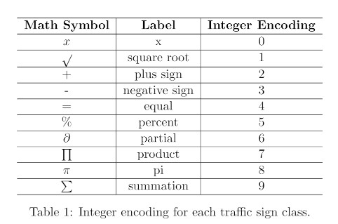

<!--
 * @Author: Yang Fan
 * @Date: 2022-12-02 14:14:51
 * @LastEditors: Yang Fan
 * @LastEditTime: 2022-12-03 04:56:19
 * @FilePath: \undefinedc:\Users\Egp\Desktop\ML\README.md
 * github: https://github.com/FanYang991115
 * Copyright (c) 2022 by Fan Yang, All Rights Reserved. 
-->
# Handwriting Classification Based on MobileNet


## About The Project

This is a classification task.

This is a PyTorch/GPU implementation of the paper [MobileNets: Efficient Convolutional Neural Networks for Mobile Vision Applications](https://arxiv.org/abs/1704.04861)

Our dataset was collected by all students enrolled in EEL5840. We cleaned the hard case in the dataset. So the number of the images of the whole dataset is 8863. 

There's a total of 10 math symbols(10 classes)




### some of our Test result (10-fold cross-validation)
efficientnetb4
~~~
              precision    recall  f1-score   support

         0.0       0.90      0.91      0.90        76
         1.0       0.87      0.97      0.91        89
         2.0       0.97      0.94      0.96        83
         3.0       1.00      0.91      0.95        89
         4.0       0.93      1.00      0.96        89
         5.0       0.94      0.96      0.95        89
         6.0       0.95      0.96      0.95        76
         7.0       0.72      0.86      0.78        73
         8.0       0.90      0.64      0.75        89
         9.0       0.90      0.92      0.91        79

    accuracy                           0.91       832
   macro avg       0.91      0.91      0.90       832
weighted avg       0.91      0.91      0.90       832
~~~
mobilenet
~~~
         0.0       0.80      0.94      0.86        83
         1.0       0.89      0.91      0.90        69
         2.0       0.99      0.93      0.96        86
         3.0       0.97      0.90      0.93        86
         4.0       0.86      0.93      0.89        86
         5.0       0.99      0.95      0.97        83
         6.0       0.99      0.89      0.93        87
         7.0       0.79      0.98      0.87        89
         8.0       0.91      0.68      0.78        77
         9.0       0.98      0.97      0.97        86

    accuracy                           0.91       832
   macro avg       0.92      0.91      0.91       832
weighted avg       0.92      0.91      0.91       832
~~~

resnet50


~~~
              precision    recall  f1-score   support

         0.0       0.93      0.91      0.92        82
         1.0       0.76      0.97      0.85        86
         2.0       0.96      0.92      0.94        89
         3.0       0.80      0.97      0.88        79
         4.0       0.99      0.91      0.94        85
         5.0       0.94      0.94      0.94        89
         6.0       0.98      0.87      0.92        75
         7.0       0.73      0.84      0.78        79
         8.0       0.95      0.65      0.77        88
         9.0       0.97      0.94      0.96        80

    accuracy                           0.89       832
   macro avg       0.90      0.89      0.89       832
weighted avg       0.90      0.89      0.89       832
~~~

* this repo is based on [timm==0.3.2](https://github.com/rwightman/pytorch-image-models), for which a fix is needed to work with PyTorch 1.8.1+.

## Getting Started

The user will be able to recreate it using:

> conda env create -f requirements.yml

###
Download my trained model and put it into model folder.

download here:

https://drive.google.com/file/d/1S9bGAcPsLSMGxapYhcPQj_GZlMGBAvAj/view?usp=sharing


### Installation

1. Clone the repo
   ```sh
   git clone https://github.com/UF-EEL5840-F22/final-project---code-report-supersupersuperteam
   ```
2. Setup (and activate) your environment
  ```sh
  conda env create -f requirements.yml
  ```


## Fine-tuning with pre-trained checkpoints

|  | modelnetv3  | efficientnetb4 |resnet50|
| -------- | -------- | -------- | -------- |
| download | [modelnetv3](https://drive.google.com/file/d/1S9bGAcPsLSMGxapYhcPQj_GZlMGBAvAj/view?usp=share_link) |[efficientnetb4](https://drive.google.com/file/d/1TJq4psTdYw6xXhPe-9CEwdFZU_KlfPYy/view?usp=sharing) |[resnet50](https://drive.google.com/file/d/1Dy57knEMMl_qJ8CUxtT7gUYveVmQTuft/view?usp=share_link)|


## Usage
All the parameters or settings could change. And other parameters you could also adjust in the code named **get_args_parser** function to check.

### Structure

dataset folder: put the dataset in it.

model folder: save our trained model.

network folder: defined our networks.

runs folder: the log file of tensorboard

util.dataset_aug: dataloader

cvtrain.py: cross-validation training


**Note here, we didn't push our cleaned dataset, so this test or train is train on the original dataset. In this case, the result will note as good as we write in the report(acc:91%)**

### how to train?

This is trained on the original dataset instead of our cleaned dataset.

> python train.py --batch_size=64 --epochs=15 --model efficientnet_b4 --lr=0.01 --data_path ./dataset/data_train.npy --label_path ./dataset/t_train.npy

### how to test

**acc:86% on the original dataset**

**you could download our cleaned dataset [here](https://drive.google.com/file/d/1npuauW8-BqTPU1fqmMESOOUDy66CSJnI/view?usp=sharing)**

**note,this is test on the whole training dataet, so it would not be the same result as we mentioned in the report**

> python test.py --model mobilenetv3_rw --model_path ./model/mobilenetv3_rw --batch_size=64 --data_path ./dataset/data_train.npy --label_path ./dataset/t_train.npy

## License

Distributed under the MIT License. See `LICENSE` for more information.

## Authors
~~~
@Report{Handwriting Classification Based on EfficientNetB4},
    auther = {Yang Fan, Liu Yu, Zhang Yiheng, YangYang}
    title  = {Handwriting Classification Based on EfficientNetB4}
    year = {2022}
~~~


## Thank You