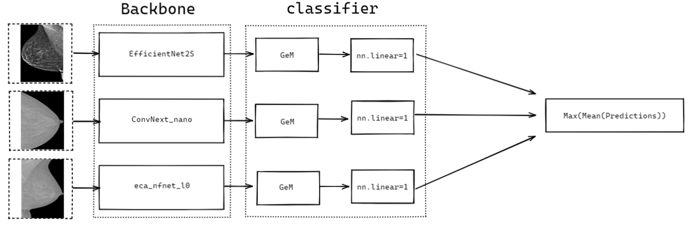
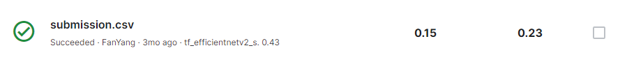
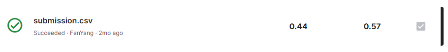
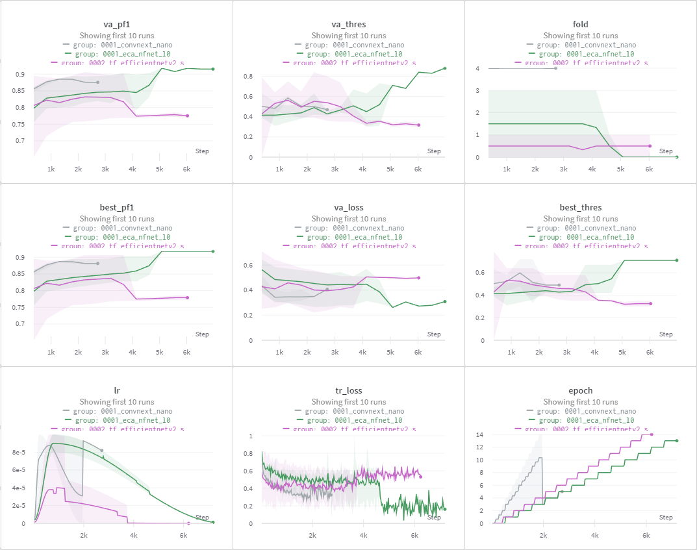

<!-- ABOUT THE PROJECT -->
# 72nd RSNA Screening Mammography Breast Cancer Detection🥈


This project aims to develop an algorithm for the early detection of breast cancer using screening mammography. The dataset used is provided by the Radiological Society of North America (RSNA) and includes anonymized digital mammograms from women who participated in screening programs in the United States.

The project is based on the RSNA Screening Mammography Dataset.
[Kaggle RSNA Screening Mammography Dataset](https://www.kaggle.com/competitions/rsna-breast-cancer-detection/data) and [VinDr-mammo Dataset(not applied in report but in competition)](https://vindr.ai/datasets/mammo/).

The goal of this project is to build a deep learning model that can accurately classify breast cancer in mammography images. We achieved a ranking of  **72nd** place in the competition.
We ranked **30th in Public Score and 72nd** in Private Score.

<center>Figure1 Network</center>

---

<!-- GETTING STARTED -->
## Getting Started 🍖

In this section, I'll provide instructions on how to recreate the project locally using this repository. Due to the large size (over 300G) of the original dataset, I also provided a basic version of the Kaggle notebook. Only include the decoder and baseline.

You can visit here.

✅[My baseline1 during competetion](https://www.kaggle.com/code/fanyang99/train-no-roi-512-lb0-24)

✅[My baseline2 during competetion](https://www.kaggle.com/code/fanyang99/rsna-roi-train-1024-512)

✅[step1-gpu-decoding](https://www.kaggle.com/code/fanyang99/step1-gpu-decoding/notebook)

✅[step2-stage1-train on RSNA](https://www.kaggle.com/code/fanyang99/step2-stage1-train)
<!-- 
❌ [Step2 Stage1 Train on VinDr](https://www.kaggle.com/fanyang99/step2-stage1-train-on-vindr)

✅[Step3 Stage2 Finetune on RSNA](https://www.kaggle.com/code/fanyang99/step3-stage2-finetune-on-rsna/)

✅[Our final model](https://www.kaggle.com/code/fanyang99/inference) -->


**all models weight and figures are in `/blue/eel6825/f.yang1/0003/`and `/blue/eel6825/f.yang1/0001/`**

**dataset in the fold `/blue/eel6825/f.yang1/kaggle/`**

Here, we ONLY provide the Public Score and Private Score of the baseline and final model that I submitted for the competition.
| model| Public Score | Private Score|
| --- | --- | --- |
| baseline | 0.15 | 0.23 |
| our | 0.44 | 0.57 |



<center>Figure2 baseline</center>


<center>Figure3 our</center>



<center>Figure4 some of our experiments</center>

---


### Dependencies🥕

I have exported my Python working environment, and pushed it to my project's repository and allowed users to clone it locally. And You are able to recreate it using:

  ```sh
  conda env create -f requirements.yml
  ```

Here are some libs we maily use.
* wandb (Weights & Biases)
* timm (PyTorch Image Models)
* torch (PyTorch)
* torchvision
* albumentations
* NVIDIA DALI
* numpy
* pandas
* scikit-learn (sklearn)
* OpenCV (cv2)
* Pillow (PIL)

### Installation❄

Due to the large size of the dataset, which is over **300GB**, it is not recommended to download the data and run the project locally. Instead, it would be better to check out a demo on Kaggle that provided on the getting started part and then you can check the code on HPG. For running the project on a local machine or HPG, I will demonstrate the process in the video.

1. Clone the repo
   ```sh
   git clone https://github.com/uf-eel6825-sp23/final-project-code-FanYang991115
   ```
2. Setup (and activate) your environment
  ```sh
  conda env create -f requirements.yml
  ```

<!-- USAGE EXAMPLES -->
## Usage 👓

This class, CFG, contains various configurations and hyperparameters for the model training process. By modifying some of the attributes in this class and the corresponding data paths, you can easily run the code with your own settings.

```python

class CFG:
    suff = "0001"
    image_size =  (256, 256)
    epochs = 15
    model_arch = 'tf_efficientnetv2_s'
    dropout = 0.0
    fc_dropout=0.2
    es_paitient = 3
    onecycle = True
    onecycle_pct_start = 0.1
    max_lr = 1e-4
    optim = "AdamW"
    weight_decay = 0.01
    accum_iter=1
    positive_target_weight = 1
    neg_downsample = 0.35
    train_batch_size = 16
    valid_batch_size = 8
    mixup_rate = 0.5
    mixup_alpha = 0.5
    tta = True
    seed = 1788
    num_workers = 5
    n_folds = 5
    folds = [0]
    gpu_parallel = False
    device = 'cuda' if torch.cuda.is_available() else 'cpu'
    df_path = f'/kaggle/input/rsna-breast-cancer-detection/'

    normalize_mean= [0.485, 0.456, 0.406]  
    normalize_std = [0.229, 0.224, 0.225]  

    wandb_project = f'RSNA2023-V5' 
    wandb_run_name = f'{suff}_{model_arch}'

    target = 'cancer'

comp_data_dir = './input/rsna-breast-cancer-detection'
images_dir = f'./input/images_gpugen/1536896_16bit_cutoff'
output_dir = f'./output/{CFG.suff}'

```

---


<!-- LICENSE -->
## License💡

Distributed under the MIT License. See `LICENSE` for more information.


<!-- Authors -->
## Authors💡

Your Name - [@fanyang16040178](https://twitter.com/fanyang16040178) - f.yang1@ufl.edu

Project Link: [https://github.com/uf-eel6825-sp23/final-project-code-FanYang991115](https://github.com/uf-eel6825-sp23/final-project-code-FanYang991115)


<!-- ACKNOWLEDGEMENTS -->
## Acknowledgements💡

You can acknowledge any individual, group, institution or service.
* [Catia Silva](https://faculty.eng.ufl.edu/catia-silva/)
* [Pattern Recognition and Intelligent Systems](https://github.com/uf-eel6825-sp23)
* [calvchen](https://github.com/chqwer2)
* [SMILE lab](https://github.com/lab-smile)

## Thank you💡😆

<!-- If this is useful: [](https://www.buymeacoffee.com/catiaspsilva) -->
